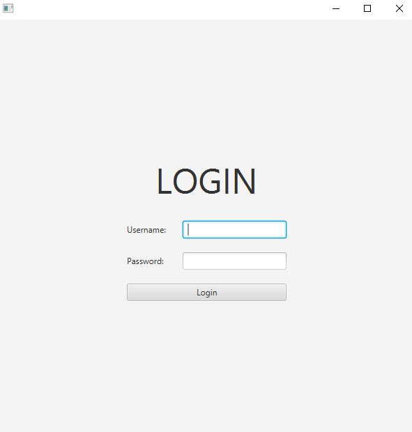
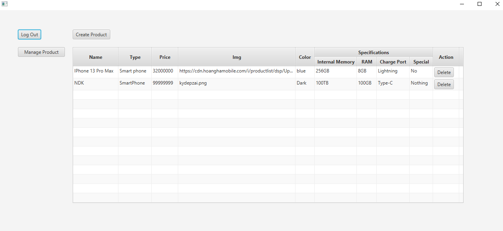
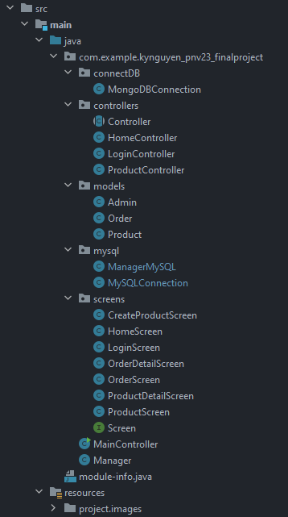
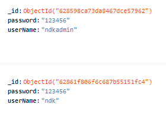
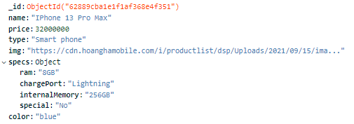

# JavaFX connect DB
### ***Pay attention to choose the project system libs (Maven and Gradle)
1. Add library mysql-connector in build.gradle
```.gradle
    dependencies {
        implementation("mysql:mysql-connector-java:8.0.29")
    }
```
2. In module-info.java, add required 
```
    module your_projectname {
        requires java.sql;
    }
```
3. Create a DBConnect class, declare constants
```java
    //example 
    public class DBConnect {
        private static final String URL = "jdbc:mysql://localhost/ndkshop"; //jdbc:mysql is required 
        private static final String USERNAME = "root";
        private static final String PASSWORD = "";
    }
```
4. Connect MySQL with java.sql
```java
    import java.sql.*;

    public class DBConnect {
        private static final String URL = "jdbc:mysql://localhost/ndkshop"; //jdbc:mysql is required 
        private static final String USERNAME = "root";
        private static final String PASSWORD = "";
        private Connection connection;
        
        public DBConnect() {
            try {
                connection = DriverManager.getConnection(URL, USERNAME, PASSWORD);
                System.out.println("Connect successfully!!!");
            } catch (SQLException e) {
                connection = null;
                System.out.println(e);
            }
        }
        public Connection getConnection() {
            return connection;
        }
    }
```
5. How to query mysql?<br>
Here is an example:
```java
    var connection = new DBConnect().getConnection();
    ArrayList<Admin> list = new ArrayList<>();
    try {
        var result = connection.prepareStatement("SELECT * FROM admins").executeQuery();
        while (result.next()) {
            list.add(new Admin(
                            result.getString(1),
                            result.getString(2)
                    )
            );
        }
    } catch (SQLException e) {
        throw new Error("Can't query!!!" + e);
    }
```

# My Project - Manage A Phone Store
- Login screen

- Product management screen

### Project structure

- My project has 4 main packages: connectDB, controllers, models and screens
### Database
- My project uses MongoDB to store the data
  - Admins Collection <br/>

  - Products Collection <br/>

### Done features
- Login, logout
- Manage products (Create, Update, Delete, Show)
### Doing features
- Manage orders (Create, Delete, Show)
### Will do-features
- Export data to excel file
### Video demo: (https://drive.google.com/file/d/1yQKloQz2pH8E113T0N1pqaJbgI5x_Ouw/view?usp=sharing)

